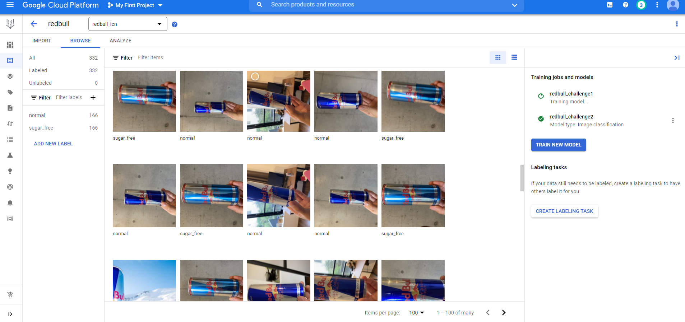
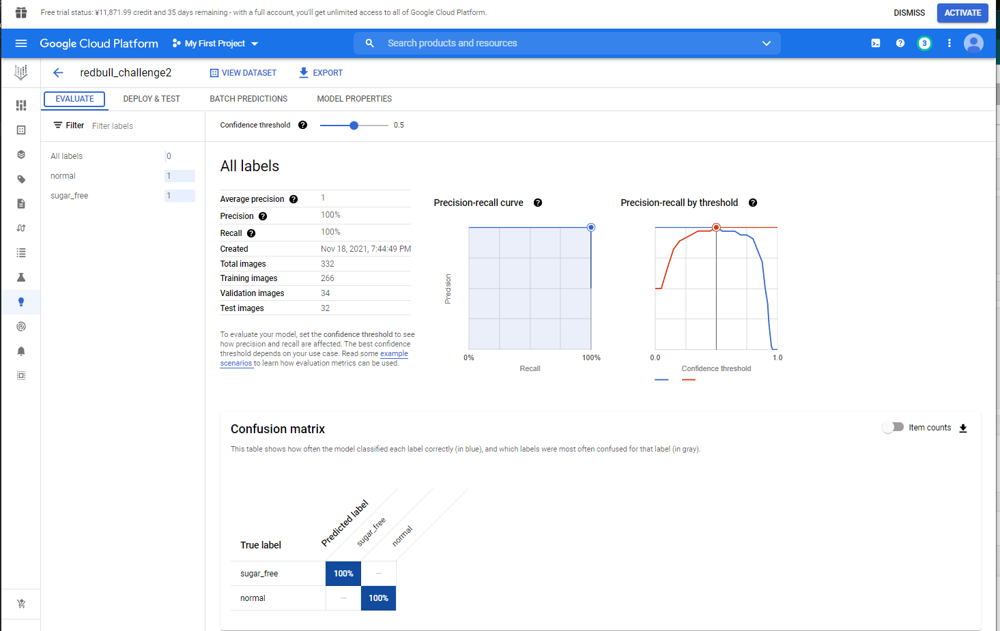
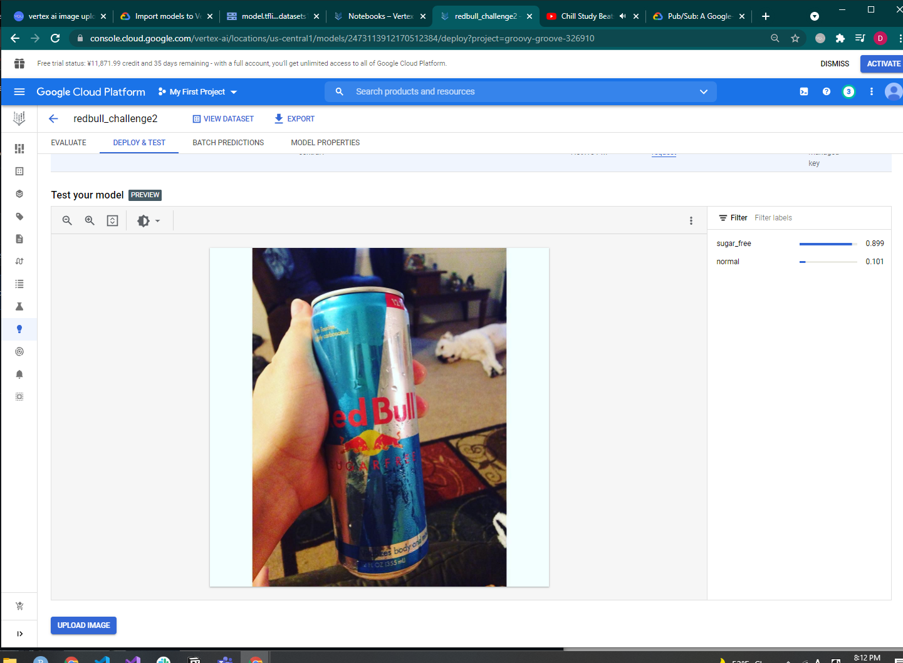

# RedBull Vision

## Background

As my previous experience as Computer Vision Engineer and the current experience as Cloud Engineer motivates me to demostrate End-to-end Machine Learning System harnessed by Google Cloud Platform 

## Methodology
The images are collected via Internet as well as myself.
`iphone's burst mode` is used collect more than 100 images for each type of RedBull

## Setup

- Algorithm: InceptionResNetV2(Pretrained on ImageNet)
- Orchestration: Kubeflow
- Platform: GCP Vertex AI 
- Pipeline type: Custom Training(If you choose autoML, refer to [autoML notebook](https://github.com/kwdaisuke/MLOps/blob/main/autoML_pipeline.ipynb))


## Overview

```python
from google.cloud import storage

client = storage.Client()
bucket =  # set bucket name

df = pd.DataFrame({"path": [file.name for file in client.list_blobs(bucket)]}) # loop over filenames
df["type"] = df.path.apply(lambda df: df.split("/")[-2]) # get folder name ex: sugar_free, normal
df.to_csv("schema.csv", index = False) # export to csv

fullpath = "gs://"+bucket
!gsutil cp schema.csv fullpath
```

### Training Dataset


### Model Performance
AutoML is used in this demonstration. \
You can also configure the custom training
The accuracy is 100 % for the testing


### Inference 
This model predict the image as sugar free Red Bull with 89.9% of probability 



## Design Pattern

Pattern1: End-to-end notebook \
[Redbull Classification Pipeline](https://github.com/kwdaisuke/MLOps/blob/main/transfer_learning_custom_pipeline.ipynb) 

Pattern2: AutoML


Pattern3: Function-based components \
https://github.com/GoogleCloudPlatform/vertex-ai-samples/blob/master/notebooks/official/pipelines/lightweight_functions_component_io_kfp.ipynb

Pattern4: Control Structure \
https://github.com/GoogleCloudPlatform/vertex-ai-samples/blob/master/notebooks/official/pipelines/control_flow_kfp.ipynb

Pattern5: Schedule pipeline execution \
https://cloud.google.com/vertex-ai/docs/pipelines/schedule-cloud-scheduler

Pattern6: Data Management pipeline \

Pattern7: Tensorflow Advanced pipeline \

Pattern8: Batch Prediction


## Reference
- https://github.com/GoogleCloudPlatform/vertex-ai-samples/blob/master/notebooks/official/pipelines/google_cloud_pipeline_components_model_train_upload_deploy.ipynb
- https://github.com/GoogleCloudPlatform/training-data-analyst/blob/master/self-paced-labs/vertex-ai/vertex-ai-qwikstart/lab_exercise.ipynb 
- https://github.com/GoogleCloudPlatform/vertex-ai-samples/blob/master/notebooks/official/custom/sdk-custom-image-classification-batch.ipynb
- https://cloud.google.com/vertex-ai/docs/pipelines/notebooks


## Memo

- Importing dataset from vertex dataset is not necessary if using gcs 
- Remove additional configuration(docker setup, yaml etc...) purely focusing on the pipeline components
